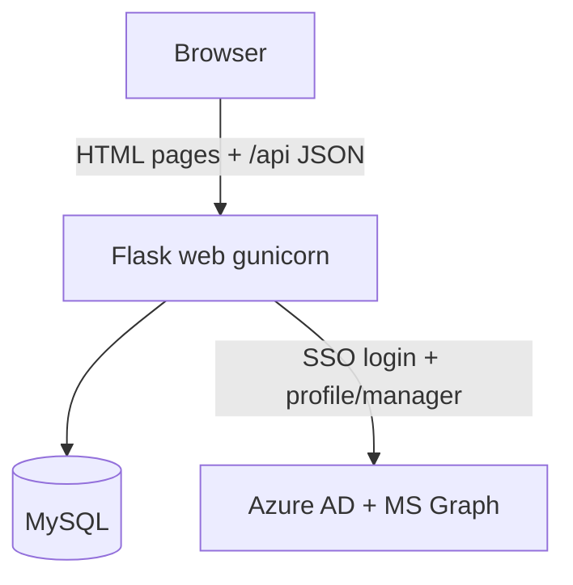
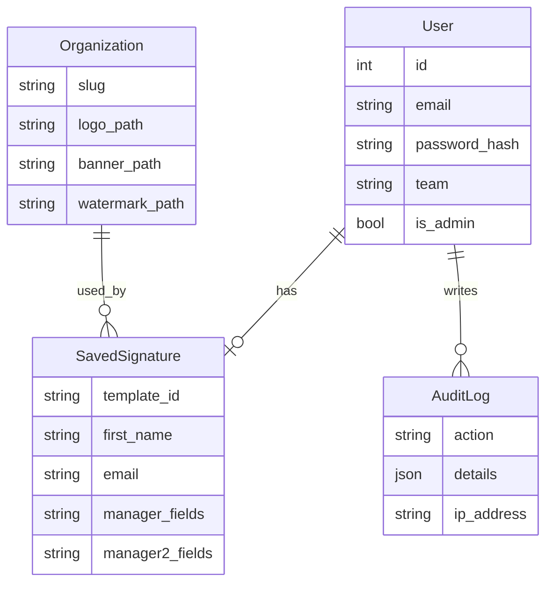
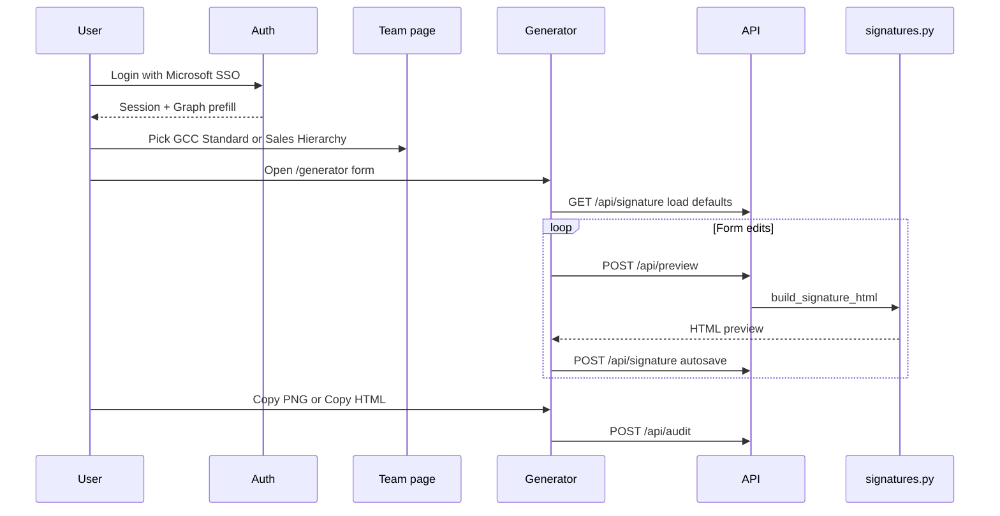

# Arvind Signature Generator

Internal email signature generator for Arvind Group companies. Employees log in, pick a template style, fill details, preview branded HTML, then copy as PNG or HTML into Outlook, Gmail, or Zoho Mail.

There is **no Outlook API or add-in** — "Outlook" means the intended paste destination.

## Tech stack

- **Backend:** Python 3.12, Flask (app factory + blueprints), Flask-SQLAlchemy, Flask-Migrate
- **DB:** MySQL 8 via PyMySQL (`DATABASE_URL`)
- **Auth:** Session-based Microsoft Azure AD SSO only (MSAL + Graph)
- **Frontend:** Jinja2 templates, vanilla JS, CSS; `html2canvas` for PNG copy
- **Deploy:** Docker Compose (`db` → `init-db` → `web`/gunicorn)

## Quick start

```powershell
.\start.ps1
```

This copies `.env.example` to `.env` if needed and runs `docker compose up --build`. The app is available at [http://localhost:5000](http://localhost:5000).

Configure secrets and Azure SSO in `.env` (see `.env.example`).

## High-level architecture



## Entry points and app wiring

| File | Role |
|------|------|
| `main.py` | Runs `init_db.main([])`, then `create_app()`; gunicorn target `main:app` |
| `init_db.py` | Wait for MySQL, create schema, seed orgs + demo admin |
| `app/__init__.py` | App factory; registers blueprints; `/health` |
| `start.ps1` | Copies `.env.example` if needed, `docker compose up --build` |

Blueprints registered in `create_app`:

- `auth_bp` — login / SSO / team / logout
- `generator_bp` — `/generator`
- `api_bp` — `/api/*`
- `admin_bp` — `/admin`

## Core modules

| Module | Responsibility |
|--------|----------------|
| `app/config.py` | Env-driven settings (DB, Azure, allowed domains, teams, templates) |
| `app/models.py` | `User`, `Organization`, `SavedSignature`, `AuditLog` |
| `app/auth.py` | Session login, domain allowlist, SSO user provisioning, audit writes |
| `app/microsoft_sso.py` | MSAL OAuth; Graph `/me` + `/me/manager` prefill |
| `app/signatures.py` | Org seed data, asset URLs, HTML builders (`standard` / `compact` / `minimal`) |

## Data model



- One saved signature per user (`user_id` unique)
- Sales team stores L1/L2 manager fields on `SavedSignature`
- Orgs are seeded at init (Arvind Limited, Fashions, SmartSpaces, Anup Engineering, Arvind GCC, etc.) with logo/banner/watermark paths under `app/static/assets/`

## End-to-end user flow



1. `/` → `/login` → Microsoft SSO (allowed `@arvind.*` domains)
2. SSO prefills name, designation, phone, manager from Graph
3. `/team` — **Standard (GCC)** vs **Hierarchy (Sales)** with L1/L2 manager fields
4. `/generator` — org + personal fields + live preview
5. Copy PNG via `html2canvas`, or Copy HTML with base64-embedded images (`forEmail=true`)
6. Admins view `/admin` audit log

## API surface (`app/routes/api_routes.py`)

- `GET /api/organizations` — org list for dropdown
- `POST /api/preview` — build HTML; `forEmail` switches public URLs vs data URIs
- `GET|POST /api/signature` — load / upsert saved form state
- `POST /api/audit` — client events (`signature_copied`, `html_copied`)

## Frontend

- `app/templates/generator.html` + `app/static/js/generator.js` — form binding, debounced preview/save, clipboard copy
- `app/templates/team.html` + `app/static/js/team.js` — template-style selection
- `app/templates/login.html`, `admin.html`, `base.html`

## Signature generation (`app/signatures.py`)

Server builds **inline-styled HTML tables**:

- **standard** — contact + logo + optional banner (e.g. Arvind Limited anniversary)
- **compact** — narrower variant
- **minimal** — text-only

Preview uses static asset URLs; email/copy path embeds images as base64 so the signature is self-contained when pasted.

## Auth modes

- **Microsoft SSO only:** Azure AD via MSAL; Graph profile/manager → session `profile_prefill`; auto-provisions allowed Arvind emails
- Session gates generator/API/admin; `is_admin` gates `/admin`

## Deployment layout

`docker-compose.yml` services:

1. `db` — MySQL 8
2. `init-db` — one-shot schema/seed
3. `web` — gunicorn on port 5000

Config via `.env.example`: `SECRET_KEY`, `DATABASE_URL`, MySQL creds, `APP_BASE_URL`, Azure SSO flags/IDs.

## Mental map for future changes

| Change type | Start here |
|-------------|------------|
| Signature look/layout | `app/signatures.py` + assets under `app/static/assets/` |
| Form fields / autosave | `generator.js`, `SavedSignature` model, `api_routes.py` |
| Orgs / branding | seed data in `signatures.py` / `init_db.py`, `Organization` model |
| Login / SSO / domains | `auth.py`, `microsoft_sso.py`, `config.py` |
| Admin reporting | `admin_routes.py`, `AuditLog` |
| Deploy / env | `Dockerfile`, `docker-compose.yml`, `.env.example` |
